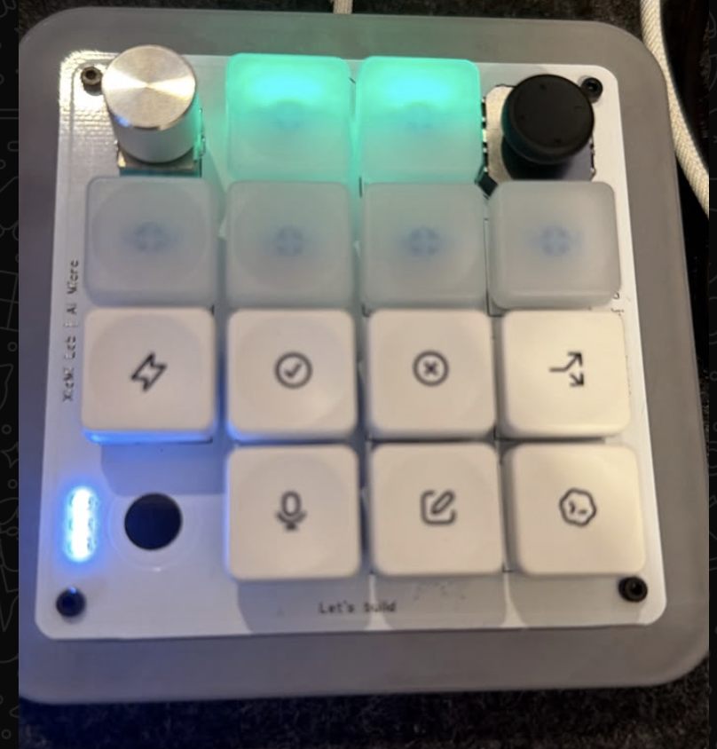
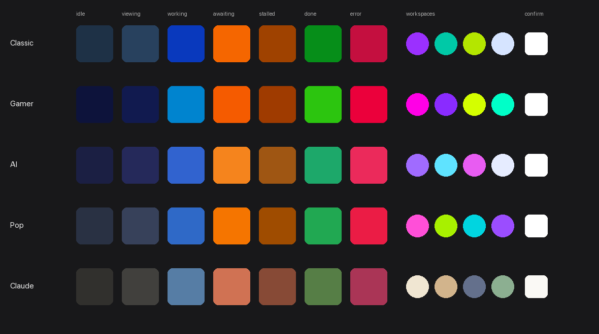
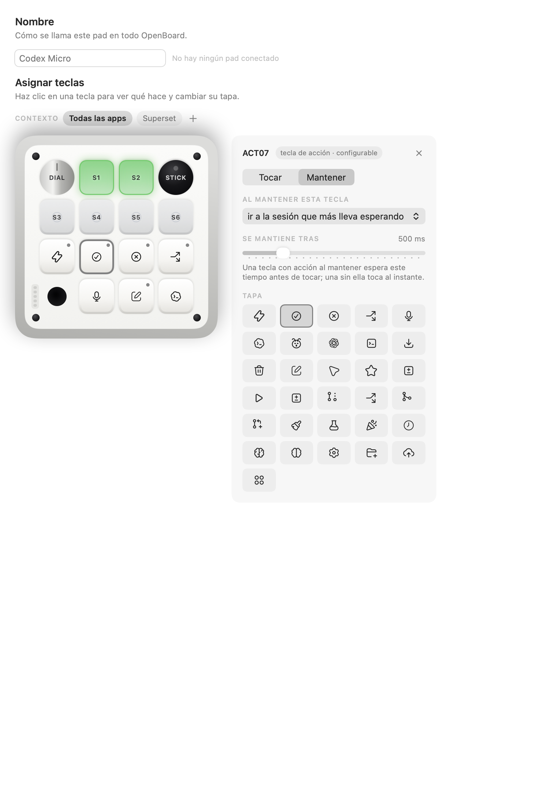
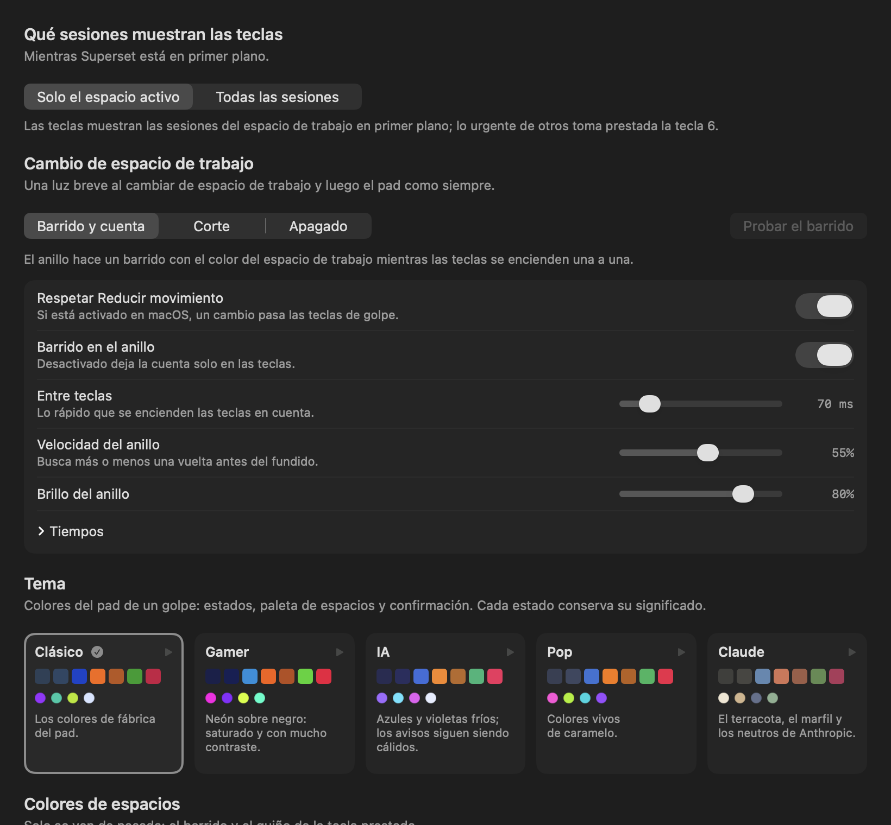

# OpenBoard · Codex Micro clone + Superset edition

**English** · [Español](README.md)

A fork of Cam Wilson's [OpenBoard](https://github.com/camwilso/openboard), adapted to a **clone**
of the Codex Micro macro pad ("Project2077", USB `303A:8360`) and to **Superset**, where several
coding sessions run side by side.

Each session key lights up with what is happening: working, waiting on you, finished or failed.
You see at a glance which session needs you, and one key takes you there or answers it.

<p align="center">
  
  
</p>

## Do you have this pad?

This fork is for the macro pad sold on AliExpress as a mini mechanical keyboard, Bluetooth/USB
with a battery, a clone of the Codex Micro:
**[AliExpress · item 1005012978606959](https://es.aliexpress.com/item/1005012978606959.html)**.

How to recognise it:
- The board reads **"XiaMi Lab | AI Micro"** and **"Let's build"**.
- macOS lists it as **"Project2077"** by "CodexMicro", USB `303A:8360`.
- 16 positions: a silver dial, a joystick, 6 frosted session keys, the FAST, APPR, REJ, BRANCH,
  MIC, NEW and CODEX caps, and 3 status LEDs next to a round opening.

If yours matches, the original OpenBoard does not handle it well (it sends events in a different
envelope); this fork does.

## What this fork adds

### Clone support
- Speaks the clone's protocol (`method`/`params` envelopes, alongside the original's `m`/`p`).
- The settings window draws this pad: dial, joystick, frosted session keys, status LEDs and the
  FAST, APPR, REJ, BRANCH, MIC, NEW and CODEX caps.

### Superset integration
- **Jumps to the exact terminal** of each session inside Superset, not just the workspace.
- **Keys follow the active workspace:** a workspace with 2 sessions lights 2 keys; switch to one
  with 1 and 1 key lights. Stable order, no gaps.
- **A light sweep when you switch workspace**, in each workspace's own color, and key 6 lent to
  urgent sessions from other workspaces.
- **Optional connection to Superset's local service** (closed allowlist of actions, read-only if
  the version changes): other agents' sessions get their own key, red when something fails, and
  the state is reconciled at launch.
- With the connection on: **start a new session** in the active workspace, **send text to or
  interrupt** a session without switching windows (armed mode), and **hand the work to another
  agent** with the terminal's history, always behind a two-step confirmation.

### Keys
- **Tap and hold**: every key can do two things, with an adjustable hold time.
- **Per-app profiles**: the joystick, dial and caps change with the app in front (with Superset in
  front, the joystick switches workspace and tab).
- **Repeating shortcuts** (for example, Escape ×2 in a single press).
- **A microphone key that actually works**: it holds the configured dictation key, with
  autorepeat like a real keyboard.
- **Answer questions from the pad alone (question mode)**: when a visible session asks you
  something, the joystick sends arrows, the dial moves between options (click = Space to tick,
  hold = Tab), APPR/REJ answer that session and FAST/CODEX are disabled so nothing is approved
  or cancelled by accident. It turns itself off once you answer.
- **Sessions stay in sync**: a session that closes abruptly has its key go dark within seconds;
  resuming it (`--resume`) brings it back to its key with the new terminal; sessions started as a
  named agent get a key too; and APPR/REJ for a session in another workspace wait for Superset to
  show it before answering.
- **Safety**: blocks dangerous snippets (`/clear`, `/exit`…), never sends ⏎ blind right after a
  snippet, and at launch does not trust saved lights until they are confirmed.

### Colors and themes
<p align="center">
  
</p>

- **5 themes**: Classic, Gamer, AI, Pop and Claude. In all of them, "waiting on you" is warm,
  error red, finished green and working blue; tests check it.
- **Your own themes**: save, duplicate, rename, delete, import and export as JSON
  ([format](docs/teclado/formato-temas.md), in Spanish).
- Choosing a theme plays it on the pad for a few seconds before applying it.
- **Fast lights**: a full-brightness flash when a state changes, shorter edge animations and an
  adjustable speed (normal, fast, very fast).
- [**Palette designer**](docs/teclado/disenador-paletas.html): a page to design a theme on a
  drawing of the pad, with the rules checked live, and export it.

### Interface
<p align="center">
  
  
</p>

- The whole interface in **Spanish or English**, chosen in Settings → Device.
- The settings window adapts to its width without covering the key panel.

## Build

```sh
cd mac
swift run OpenBoardTests          # over 1,000 tests
tools/build-app.sh --install      # signs with your local certificate if there is one
```

Without a Developer ID certificate, create a local one with `mac/tools/make-signing-cert.sh` so
macOS permissions survive rebuilds.

> **Careful with the clone:** do not open Work Louder Input or the Codex Micro desktop app with
> the clone plugged in. This pad has a single firmware partition, and a wrong flash bricks it.

## Credits and license

Based on [OpenBoard](https://github.com/camwilso/openboard) by Cam Wilson and contributors, MIT
licensed (see [`LICENSE`](LICENSE)). The original OpenBoard documentation is still in
[`docs/`](docs/).
